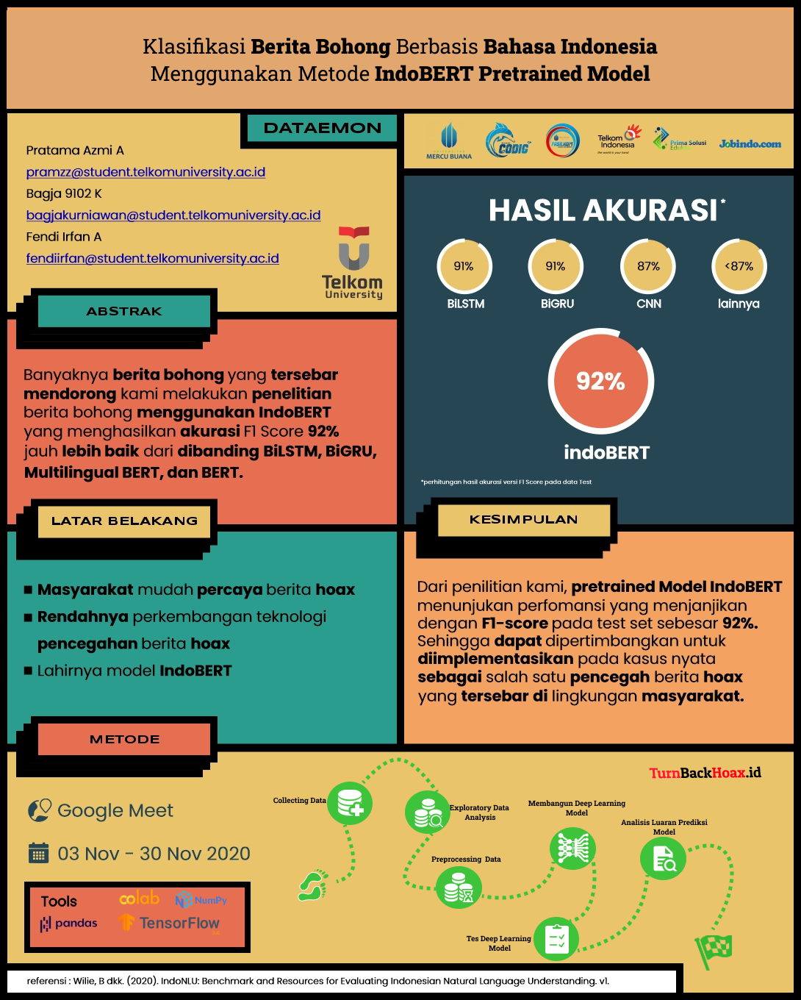

Study Cases : Klasifikasi berita Bohong

- [Dataset](https://github.com/Xwyzworms/BenchMark-Klasifikasi-BeritaBohong/blob/main/datasetHoax%20(1).csv)
- [Model Building With Deeplearning](https://github.com/Xwyzworms/BenchMark-Klasifikasi-BeritaBohong/blob/main/CODIG%203.0%20-%20(Penambangan%20data)%20-%20Universitas%20Telkom.pdf)
- [Model Building With Machine Learning](https://github.com/Xwyzworms/BenchMark-Klasifikasi-BeritaBohong/blob/main/CodigHoaxWithML.ipynb) 

Team members : 
- [Bagja 9102 Kurniawan](https://www.linkedin.com/in/bagja9102/)
- [Fendi Irfan Amorokhman](https://www.linkedin.com/in/fendiirfan/)
- [Pratama Azmi Atmajaya](https://www.linkedin.com/in/pratamaazmia/)

<h3> Model : https://drive.google.com/file/d/1JOEugxxj1rHY29ASlJHDMK7LpY8ZCFB0/view?usp=sharing </h3>

</img>

<h4> POSTER </h4>
</img>
